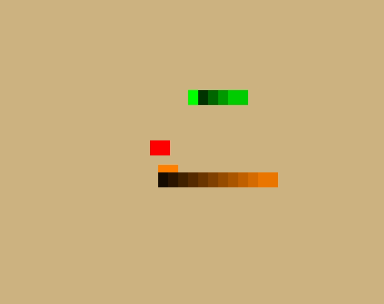

# Jogo da Cobrinha

Este é um simples jogo da cobrinha implementado em C++ utilizando OpenGL e GLFW. O jogo possui duas cobras: uma controlada pelo jogador (Verde) e outra controlada por uma IA (Laranja).



## Requisitos

Para rodar o projeto, é necessario ter instalado:

- C++
- [OpenGL]
- [GLFW]
- [GLEW]

## Como Compilar

1. Certifique-se de que todas as bibliotecas necessárias (OpenGL, GLFW, GLEW) estejam instaladas.
2. Baixe ou clone este repositório.
3. Crie uma pasta `build` dentro do diretório do projeto:

    ```bash
    mkdir build
    cd build
    ```

4. Gere os arquivos de compilação com CMake:

    ```bash
    cmake ..
    ```

5. Compile o projeto:

    ```bash
    cmake --build .
    ```

6. Execute o jogo:

    ```bash
    ./jogo
    ```

## Controles

- **W** - Mover para cima
- **S** - Mover para baixo
- **A** - Mover para a esquerda
- **D** - Mover para a direita
- **Esc** - Sair do jogo

## Como Jogar

- Mova a cobra do jogador usando as teclas **W**, **S**, **A** e **D**.
- A cobra da IA se moverá automaticamente em direção à comida.
- O objetivo é comer a comida (representada como um quadrado vermelho) e fazer a cobra crescer.
- Evite colidir com seu próprio corpo, com as bordas da tela, ou com a cobra da IA.
- A comida aparecerá em uma nova posição após ser comida.
